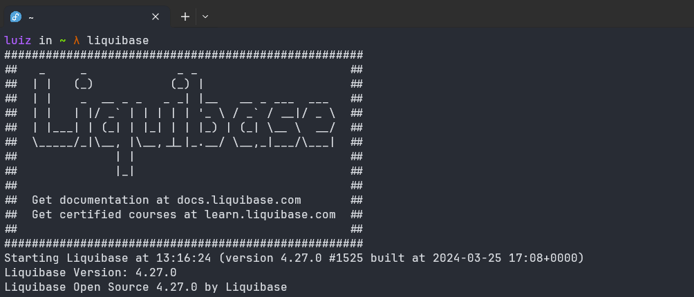

# liquibase-rpm

<a href="https://copr.fedorainfracloud.org/coprs/luiz-b/liquibase/package/liquibase/"></a>

A simple project to package most recent liquibase version into rpm package.

With a simple

```
dnf copr enable luiz-b/liquibase
dnf install liquibase
```

Install liquibase and create a symlink in bin folder.

And thats it:



